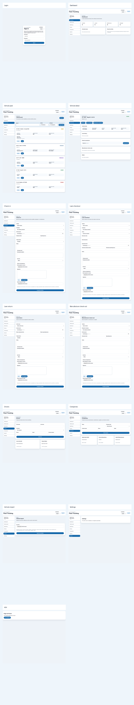

# App Screenshots

These screenshots were captured from the actual app running locally with:

- Django backend
- React frontend
- temporary seeded SQLite data
- same-origin local proxy for API/session requests

## Contact sheet

## Individual pages

- [Login](login.png)
- [Dashboard](dashboard.png)
- [Vehicle pool](vehicle-pool.png)
- [Vehicle detail](vehicle-detail.png)
- [Check-in workflow](workflow-check-in.png)
- [Loan checkout workflow](workflow-loan-checkout.png)
- [Loan return workflow](workflow-loan-return.png)
- [Manufacturer check-out workflow](workflow-manufacturer-checkout.png)
- [Drivers](drivers.png)
- [Companies](companies.png)
- [Vehicle import](admin-import.png)
- [Settings](settings.png)
- [Page not found](not-found.png)
